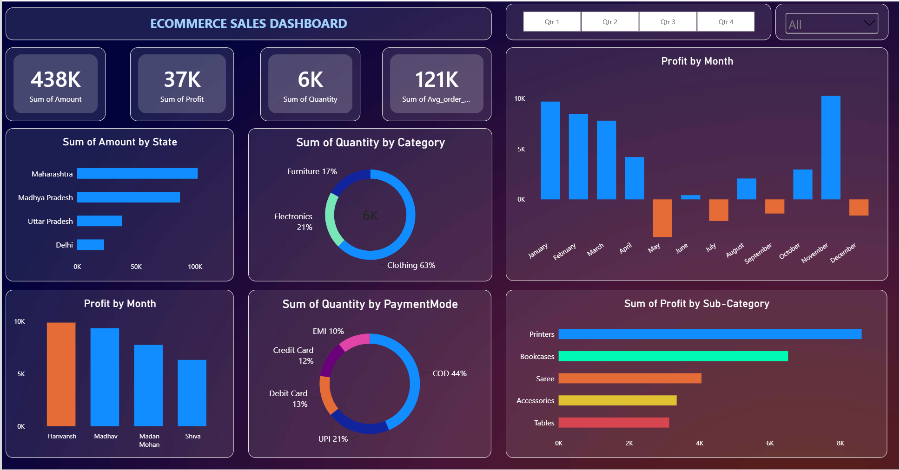
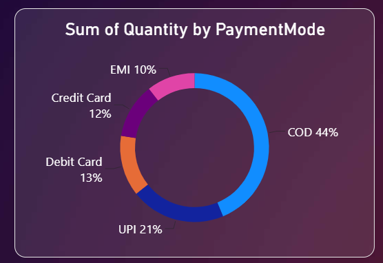
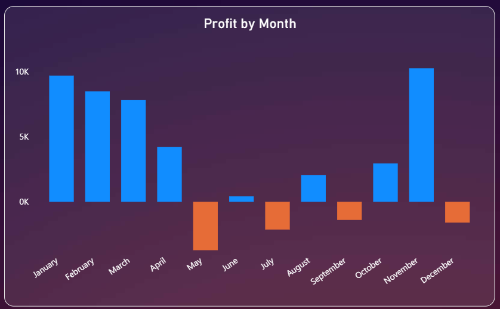

# E-Commerce Sales Dashboard (Power BI)

An interactive Power BI dashboard that analyzes e-commerce sales performance — tracking revenue, profit, and order volume across product categories, payment modes, states, and time — to support data-driven business decisions.

## 📊 Dashboard Preview




| | |
|---|---|
|  |  |

## 🔑 Key Features

- **KPI cards** — Total Sales, Total Profit, Total Quantity, and Average Order Value at a glance
- **Category & Payment Mode breakdowns** via donut charts
- **State-wise and Sub-Category-wise profit analysis** via bar charts
- **Monthly profit trend and top-customer analysis** via column charts
- **Conditional formatting** that flags loss-making transactions (color-coded by profit sign)
- **Interactive slicers** (State, Quarter) for self-serve, drill-down exploration

## 🗂️ Data Model

Two related tables:

| Table | Fields |
|---|---|
| **Orders** | Customer Name, State, Order Date |
| **Details** | Category, Sub-Category, Payment Mode, Quantity, Amount, Profit, Avg Order Value |

## 🧮 Core DAX Measures

> Fill these in with your exact formulas before publishing — this is a starting template based on the dashboard's structure.

```dax
Total Sales     = SUM(Details[Amount])
Total Profit    = SUM(Details[Profit])
Total Quantity  = SUM(Details[Quantity])
Avg Order Value = AVERAGE(Details[Avg_order_value])
Profit Margin % = DIVIDE([Total Profit], [Total Sales])
```

## 🛠️ Tools & Skills Used

- Power BI Desktop
- DAX (Data Analysis Expressions)
- Relational data modeling across multiple tables
- Dashboard design & UX for business decision-making

## 📁 Repository Structure

```
ecommerce-sales-dashboard-powerbi/
├── README.md
├── Ecommerce_Sales_Dashboard.pbix
└── screenshots/
    ├── 01-dashboard-overview.png
    ├── 02-category-payment-breakdown.png
    └── 03-regional-monthly-trends.png
```

## 🚀 How to Explore

1. Clone or download this repository
2. Open `Ecommerce_Sales_Dashboard.pbix` in [Power BI Desktop](https://powerbi.microsoft.com/desktop/) (free)
3. Interact with the State and Quarter slicers to filter the data, and hover over any visual for details

---

**Dewansh Garg** · [Portfolio](https://dewansh32.github.io/My-Portfolio/) · [LinkedIn](https://linkedin.com/in/dewanshgarg) · [GitHub](https://github.com/Dewansh32)
